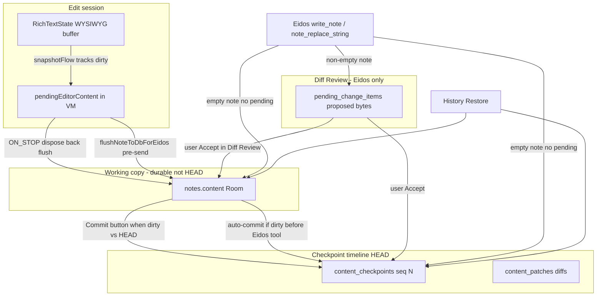
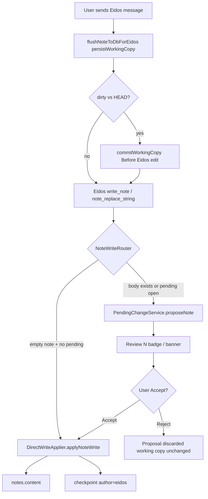

# Note Persistence Model — Working Copy vs Version History

| Field | Value |
|-------|-------|
| **Status** | Active — 2026-07-17 (Phase 1b / Phase 3 revision + user Commit model) |
| **Audience** | Mobile Kotlin implementers, Eidos prompt authors, desktop coordinator |
| **Related** | [EDITOR_AND_PANELS.md](EDITOR_AND_PANELS.md), [DIFF_REVIEW.md](DIFF_REVIEW.md), [DUMPEDIT.md](DUMPEDIT.md), [DATA_MODEL.md](DATA_MODEL.md), [NOTE_EDITOR_HARDENING_PLAN.md](../implementation/NOTE_EDITOR_HARDENING_PLAN.md), [TOOL_FUNCTIONS.md](../reference/TOOL_FUNCTIONS.md) |
| **Supersedes** | Phase 1 debounced-save model (500ms auto-save + auto-checkpoint) — removed |

This doc is the canonical model for **how note content is persisted and versioned**. It exists because the editor is not a typical notes app: it is a shared human + LLM environment with a git-like checkpoint timeline. Treat this as the source of truth; the phased task tables live in [NOTE_EDITOR_HARDENING_PLAN.md](../implementation/NOTE_EDITOR_HARDENING_PLAN.md).

---

## Core principle

A note has **three layers**, not one "Save":

| Layer | What it is | Storage | Git analogy |
|-------|-----------|---------|-------------|
| **Edit session** | Live WYSIWYG buffer while the user types | `RichTextState` + `pendingEditorContent` (in-memory) | Unsaved buffer in the editor |
| **Working copy** | Durable current bytes — may differ from HEAD | `notes.content` (Room) | Working tree |
| **Version history (HEAD)** | Git-like sequence of accepted commits | `content_checkpoints` + `content_patches` | Commits on `main` |

**HEAD** = the latest checkpoint in the timeline (`content_checkpoints` highest `sequence` for this note). The working copy is **not** HEAD until the user **Commits** (or edits are **auto-committed** before Eidos runs).

A typical notes app collapses working copy and history into one silent auto-save. OptimalX keeps them distinct so:

1. Human edits survive navigation without spamming History.
2. The user can explicitly **Commit** to create a rollback point.
3. Eidos proposals go through **Diff Review** only — human edits never enter the pending queue.



---

## Persistence contract

| Action | Writes `notes.content`? | Creates checkpoint seq (HEAD)? |
|--------|-------------------------|--------------------------------|
| User types (Edit mode) | No (buffer only) | No |
| Leave note / `ON_STOP` / back flush | **Yes** — working copy | **No** |
| Eidos pre-send flush (`flushNoteToDbForEidos`) | **Yes** — so tools see user draft | **No** (see auto-commit row below) |
| **Commit** (top bar, when dirty vs HEAD) | No (already on disk) | **Yes** — `author=user` |
| **Auto-commit before Eidos** (dirty vs HEAD at tool time) | No (flush already wrote disk) | **Yes** — `author=user`, label e.g. `"Before Eidos edit"` |
| Eidos proposal queued (non-empty note) | No (proposal in queue) | No (`ensureProposalBaseline` may reuse HEAD) |
| **Diff Review Accept** (Eidos) | **Yes** | **Yes** — `author=eidos` via `DirectWriteApplier` |
| Eidos auto-apply (empty note, no pending) | Yes | Yes (`author=eidos`) |
| History Restore | Yes | Yes (`author=user`, label `"Restored to seq N"`) |

### Dirty vs HEAD

A note is **dirty** (uncommitted) when:

```text
sha256(notes.content) != sha256(latest checkpoint contentBlob)
```

If no checkpoint exists yet, the first Commit or auto-commit creates the baseline anchor (`baselineIfMissing` / seq 0 pattern) then appends the commit.

Three invariants:

1. **No debounced save.** The working copy is written only on leave / Eidos pre-send flush — never on a timer.
2. **No checkpoint from leave-flush alone.** Leaving persists the working copy; it does not advance HEAD.
3. **Human edits never use Diff Review.** Commit (manual or auto-before-Eidos) is the user path to HEAD. Diff Review is **Eidos-only**.

---

## Human commits (not Diff Review)

Human typing does **not** go through `PendingChangeService` or `DiffReviewScreen`. Instead:

| Path | When | Effect |
|------|------|--------|
| **Leave / flush** | User navigates away or Eidos pre-send flush | `persistWorkingCopy()` — durable bytes, not HEAD |
| **Commit** | User taps **Commit** in the editor top bar when dirty vs HEAD | `commitWorkingCopy()` — new checkpoint, content already in `notes.content` |
| **Auto-commit** | Eidos is about to write (`write_note` / `note_replace_string`) and working copy ≠ HEAD | `commitWorkingCopy()` first, then normal Eidos routing |

**Why not Diff Review for humans?** Eidos Diff Review holds proposals in `pending_change_items` while **disk stays frozen** until Accept. Human edits already live on disk after leave-flush. Reusing the Eidos queue would double semantics and produce competing Review items. **Commit** is the symmetric path to HEAD without overloading Diff Review.

**Commit must not reload WYSIWYG mid-edit.** Appending a checkpoint is a metadata write only — same invariant as Phase 1b (no DB → editor reload loop while `userHasEdited`).

### Typical flow: paste context → ask Eidos to edit

1. User pastes health info, leaves note → working copy updated (uncommitted).
2. User sends Eidos message → `flushNoteToDbForEidos` persists draft → **auto-commit** if dirty → paste is now **HEAD seq N**.
3. Eidos `note_replace_string` → queued proposal; diff is **HEAD → Eidos proposal**.
4. User **rejects** → disk stays at seq N (their paste).
5. User **accepts** a bad edit → **History → Restore** to seq N.

---

## Eidos + Diff Review flow

Eidos writes route through [`NoteWriteRouter`](../../src/main/java/com/example/optimalx/data/revision/NoteWriteRouter.kt).

**Precondition:** if working copy is dirty vs HEAD, **auto-commit** runs immediately before the router (after `flushNoteToDbForEidos` on send, or at tool entry). This ensures Eidos always diffs against committed user content and that rollback points exist before LLM edits.

Routing (unchanged after auto-commit):

- **Empty note, no pending proposal** → auto-apply immediately (`DirectWriteApplier.applyNoteWrite`): writes `notes.content` + checkpoint, no Diff Review.
- **Note already has body, or a pending proposal is open** → **queue** for review (`PendingChangeService.proposeNote`). The working copy is untouched while the proposal is open.
  - User sees **Review N** in the editor top bar / chat banner → `DiffReviewScreen`.
  - **User must Accept** for the proposal to land in `notes.content` and create a checkpoint.
  - A later Eidos write **supersedes** the earlier pending item for that note — one open proposal per note.

`flushNoteToDbForEidos` persists the user's draft to `notes.content` so `note_replace_string` matches what the user sees. It does **not** create a checkpoint by itself; auto-commit at Eidos tool time handles dirty → HEAD when needed.



---

## Editor top bar controls

| Control | Visible when | Action |
|---------|--------------|--------|
| **Commit** | Working copy ≠ HEAD (or buffer flushed and ≠ HEAD) | `commitWorkingCopy()` → new user checkpoint |
| **Review N** | Open Eidos pending proposal(s) | `DiffReviewScreen` — Accept / Reject Eidos only |
| **History** | Always (note panel) | `ContentHistorySheet` — browse HEAD timeline, Restore |

Save-status UI (separate from Commit):

- **Unsaved** = edit buffer differs from `notes.content`
- **Saved** = working copy flushed (may still be uncommitted vs HEAD)
- Optional **Uncommitted** indicator when flushed but dirty vs HEAD — implementation detail

---

## Why the debounce model was removed

Phase 1 coupled three operations into a single 500ms debounced save:

1. `toMarkdown()` encode of the WYSIWYG buffer
2. `notes.content` write
3. `snapshotNoteCheckpoint` (a commit)

Combined with clearing `userHasEdited` on save, this triggered a WYSIWYG reload from the DB **mid-edit**, which wiped span styles, newlines, and cursor position (root cause of the "formatting disappears" reports). Even after the reload hotfix, auto-committing on every typing pause made History noisy and blew through the 5-checkpoint retention (`MAX_CHECKPOINTS_PER_SOURCE`) with meaningless snapshots.

The fix is structural: **separate working-copy write from commit**, stop writing on a timer, and commit only on explicit **Commit**, **auto-commit before Eidos**, Diff Review Accept, empty-note auto-apply, or Restore.

Crash-safety tradeoff: content is persisted on leave/flush only. If the OS kills the app mid-edit before a flush, in-session edits are lost. A crash-recovery draft table is explicitly out of scope (see below).

---

## Anti-patterns (do not reintroduce)

- Debounced `notes.content` writes and/or checkpoint writes during typing.
- Reloading the WYSIWYG buffer from the DB after the editor's own working-copy flush or Commit.
- Treating leave-flush or Eidos pre-send flush alone as a History commit.
- Routing human edits through `PendingChangeService.proposeNote` or Diff Review.
- Using `richTextState.toText()` for export/share (strips markdown — see Phase 4).
- A toolbar undo/redo deque masquerading as History (removed in Phase 3).

---

## Implementation phases

Task-level tracking lives in [NOTE_EDITOR_HARDENING_PLAN.md](../implementation/NOTE_EDITOR_HARDENING_PLAN.md). Summary:

### Phase 1b — Working copy only (supersedes Phase 1 debounce tasks)

**Goal:** Persist user edits on exit / Eidos flush without versioning; WYSIWYG stays authoritative during Edit.

| Task | File(s) |
|------|---------|
| Remove `noteDebouncedSaver.schedule` from `onNoteEditorSnapshot`; snapshot only updates `pendingEditorContent`, `isNoteDirty`, `userHasEdited` | [`EditorViewModel.kt`](../../src/main/java/com/example/optimalx/ui/editor/EditorViewModel.kt) | [x] |
| Split `persistNoteSnapshot` → `persistWorkingCopy(content)` (Room only) vs `commitWorkingCopy(content, label, author)` (Commit + restore + Eidos accept paths) | `EditorViewModel.kt` | [x] |
| `flushNoteBeforeExit`, `onContentSave`, lifecycle observers call **`persistWorkingCopy` only** | `EditorViewModel.kt`, [`NotePanel.kt`](../../src/main/java/com/example/optimalx/ui/editor/panels/NotePanel.kt) | [x] |
| `flushNoteToDbForEidos`: **`persistWorkingCopy` only** — no checkpoint | `EditorViewModel.kt`, [`EditorScreen.kt`](../../src/main/java/com/example/optimalx/ui/editor/EditorScreen.kt) | [x] |
| Save-status UI: **Unsaved** = buffer differs from `notes.content`; **Saved** = working copy flushed | `EditorViewModel.kt`, [`EditorTopBar.kt`](../../src/main/java/com/example/optimalx/ui/editor/components/EditorTopBar.kt) | [x] |
| Remove or repurpose debounced saver → [`NoteEditorWorkingCopyFlusher.kt`](../../src/main/java/com/example/optimalx/ui/editor/NoteEditorWorkingCopyFlusher.kt) | same + tests | [x] |
| DumpEdit parity: exit-only persist, no checkpoint timeline | [`DumpEditViewModel.kt`](../../src/main/java/com/example/optimalx/ui/dumpedit/DumpEditViewModel.kt) | [x] |
| Replace debounce tests with flush-on-exit tests | [`NoteEditorWorkingCopyFlusherTest.kt`](../../src/test/java/com/example/optimalx/ui/editor/NoteEditorWorkingCopyFlusherTest.kt) | [x] |
| Keep hotfix: do not reload WYSIWYG from `noteUpdatedAt` while `userHasEdited` | `NotePanel.kt`, [`NoteEditorSyncPolicy.kt`](../../src/main/java/com/example/optimalx/ui/editor/NoteEditorSyncPolicy.kt) |

**Done when:** Type bold + lists → leave immediately → reopen → formatting intact in `notes.content`; History shows **no** new seq from a leave flush alone.

### Phase 3 revision — Commit + Eidos Diff Review

**Goal:** HEAD advances via user **Commit** (and auto-commit before Eidos); Diff Review stays Eidos-only.

| Control | Behavior |
|---------|----------|
| Toolbar | No undo/redo (already removed) |
| Top bar **Commit** | Visible when dirty vs HEAD; `commitWorkingCopy(author=user)` — no Diff Review |
| Top bar **Review N** | Eidos proposals only → checkpoint on Accept |
| Top bar **History** | Checkpoint timeline: user commits, auto-commits, Eidos accepts, empty-note auto-apply, restores |
| In-session typing | WYSIWYG buffer + working copy on leave; Android field undo only |

| Task | File(s) |
|------|---------|
| `isDirtyVsHead()` — compare `notes.content` hash to latest checkpoint | `EditorViewModel.kt` or `CheckpointRepository` helper | [x] |
| `commitWorkingCopy(label, author)` — checkpoint only; hash dedup; no WYSIWYG reload | `EditorViewModel.kt` | [x] |
| **Commit** button in `EditorTopBar` when dirty vs HEAD | `EditorTopBar.kt`, `EditorScreen.kt` | [x] |
| **Auto-commit before Eidos:** after `flushNoteToDbForEidos` or at `NoteWriteRouter` entry when dirty | `EditorViewModel.kt`, `EidosChatSendWorker.kt` or `RoomToolExecutor.kt`, `NoteWriteRouter.kt` | [x] |
| Verify Eidos Accept path unchanged: `PendingChangeService.accept` → `DirectWriteApplier.applyNoteWrite` | verify only | [x] |
| History sheet `workingCopy` uses `notes.content` (already) | `EditorScreen.kt` | [x] |
| Desktop parity: Commit + auto-commit before Eidos in `note-editor-plan.md` | cross-repo |

**Done when:** Leave-flush alone does not create seq; Commit creates user seq; paste + Eidos send auto-commits paste before queue; Accepting Eidos Diff Review creates eidos seq; Reject leaves HEAD unchanged.

### Phase 6 — Doc alignment

| Doc | Update |
|-----|--------|
| [EDITOR_AND_PANELS.md](EDITOR_AND_PANELS.md) | Working copy vs HEAD; Commit; no debounce checkpoints |
| [DIFF_REVIEW.md](DIFF_REVIEW.md) | Note checkpoints via Commit — not manual save debounce; Eidos-only Diff Review |
| [TOOL_FUNCTIONS.md](../reference/TOOL_FUNCTIONS.md) | Flush vs Commit vs auto-commit vs Diff Review Accept |
| [DUMPEDIT.md](DUMPEDIT.md) | Exit-only persist, no checkpoint timeline |
| Cross-repo | [`note-editor-plan.md`](https://github.com/Tuf12/OptimalXDesktop1.0/blob/main/note-editor-plan.md) |

---

## Out of scope

- Crash-recovery draft table for edits lost when the OS kills the app mid-edit.
- Human edits through Diff Review (use **Commit** instead).
- Increasing `MAX_CHECKPOINTS_PER_SOURCE` (still 5) — separate task if History feels short.
- Re-adding toolbar undo/redo instead of the git-like model.
- Prompting before auto-commit (v1: automatic when Eidos writes; optional confirm dialog is a future UX tweak).

---

## Changelog

| Date | Change |
|------|--------|
| 2026-07-17 | **Phase 3 revision shipped** — Commit button, `isDirtyVsHead`, auto-commit before Eidos in `NoteWriteRouter` |
| 2026-07-17 | **Phase 1b shipped** — `persistWorkingCopy` / `commitWorkingCopy` split; removed debounced save; `NoteEditorWorkingCopyFlusher` for exit-only flush. |
| 2026-07-17 | **User Commit model** — HEAD vs working copy; manual **Commit** for human edits; **auto-commit before Eidos** when dirty; Diff Review Eidos-only; removed "Save version" from out of scope. |
| 2026-07-17 | Doc created — extracted git-like persistence model from the hardening plan; defines Phase 1b (remove debounce) + Phase 3 revision. |
