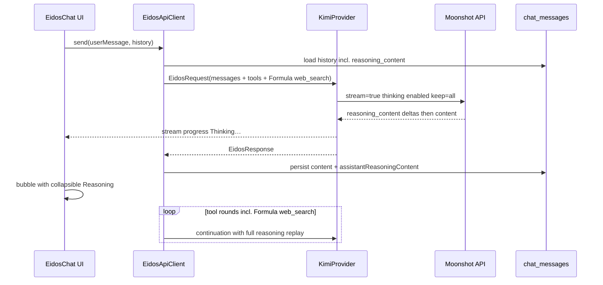

# Kimi K2.6 — Moonshot spec alignment

**Status:** Active — authoritative for Kimi K2.6 (2026-05-24)  
**Goal:** Conform Eidos code and docs to [Moonshot K2.6 thinking-model guidance](https://platform.kimi.ai/docs/guide/use-kimi-k2-thinking-model.md) so Kimi operates at full capability.

**Kimi is the primary LLM for OptimalX.** Other providers (`OpenAIProvider`, `AnthropicProvider`, `XAIProvider`) remain as fallbacks today and are intended to become **sub-LLMs that Kimi orchestrates** in a future phase (the orchestration logic is not in-tree yet). Treat Kimi as the default path when designing tools, prompts, and UX; other providers must continue to work but should not constrain Kimi-specific capabilities (Formula tools, preserved reasoning, streaming).

**Authority:** When this doc conflicts with [EIDOS_LLM_CONTEXT_CLEANUP.md](./EIDOS_LLM_CONTEXT_CLEANUP.md) or other architecture notes on Kimi transport, UX, or web tools, **this doc wins**. Update the other doc — do not weaken Kimi spec compliance in code.

**Related docs**

| Doc | Role |
|-----|------|
| [EIDOS_LLM_CONTEXT_CLEANUP.md](./EIDOS_LLM_CONTEXT_CLEANUP.md) | Lean prompts, provider families (Kimi details defer here) |
| [PROMPT_SYSTEM_IMPLEMENTATION_PLAN.md](./PROMPT_SYSTEM_IMPLEMENTATION_PLAN.md) | Cross-provider prompt checklist |
| [LLM_API_REFERENCE.md](../reference/LLM_API_REFERENCE.md) | Request/response field reference |
| [WEB_SYSTEM.md](../systems/WEB_SYSTEM.md) | Web access policy |

**Primary code**

| File | Role |
|------|------|
| [KimiProvider.kt](../../src/main/java/com/example/optimalx/data/eidos/provider/KimiProvider.kt) | Payload, message replay, response parse |
| [KimiFormulaToolService.kt](../../src/main/java/com/example/optimalx/data/eidos/provider/KimiFormulaToolService.kt) | Formula `web_search` load + Fiber execution |
| [EidosApiClient.kt](../../src/main/java/com/example/optimalx/data/eidos/EidosApiClient.kt) | Tool loop, Formula dispatch, history assembly |
| [EidosModels.kt](../../src/main/java/com/example/optimalx/data/eidos/model/EidosModels.kt) | `EidosMessage.assistantReasoningContent` |
| [EidosChatSendWorker.kt](../../src/main/java/com/example/optimalx/data/eidos/EidosChatSendWorker.kt) | Background send history rebuild |
| [EidosChatViewModel.kt](../../src/main/java/com/example/optimalx/ui/eidos/EidosChatViewModel.kt) | Foreground send + chat UI |
| [ReasoningPersistPolicy.kt](../../src/main/java/com/example/optimalx/data/eidos/ReasoningPersistPolicy.kt) | Final-hop reasoning cap for `chat_messages` |
| [ChatMessage.kt](../../src/main/java/com/example/optimalx/data/model/ChatMessage.kt) | Persisted chat rows incl. `assistantReasoningContent` |

---

## Relationship to “lean prompts”

[EIDOS_LLM_CONTEXT_CLEANUP.md](./EIDOS_LLM_CONTEXT_CLEANUP.md) principle: **reasoning on, prompts lean**.

That principle still applies to the **system prompt** (no inlined notes, folder trees, file bodies, 80k chat replay). It does **not** mean:

- skipping Moonshot-required `reasoning_content` in API `messages`, or
- hiding reasoning from the user when it hurts troubleshooting.

**Preserved `reasoning_content` is Kimi transport**, not prompt bloat. Moonshot requires it for reliable multi-step tool use. Our lean-prompt policy must not block it.

---

## Moonshot official requirements (K2.6 + thinking)

Sources:

- [Using Thinking Models](https://platform.kimi.ai/docs/guide/use-kimi-k2-thinking-model.md)
- [Model Parameter Reference](https://platform.kimi.ai/docs/api/models-overview.md)
- [Create Chat Completion](https://platform.kimi.ai/docs/api/chat.md)
- [Official Formula tools](https://platform.kimi.ai/docs/guide/use-official-tools.md) — **our web path**
- [Builtin `$web_search`](https://platform.kimi.ai/docs/guide/use-web-search.md) — reference only; **not used** (forces thinking off)

### Request knobs

| Parameter | Moonshot guidance | Eidos target |
|-----------|-------------------|--------------|
| `model` | `kimi-k2.6` | ✅ `DEFAULT_KIMI_MODEL` |
| `thinking.type` | `enabled` (chat) | ✅ always enabled for Eidos chat |
| `thinking.keep` | `"all"` only on in-flight tool continuations; omitted on normal follow-ups | ✅ |
| `reasoning_content` | Echo on **every** historical assistant message | 🔴 Phase 1 |
| `max_tokens` | **≥ 16,000** | ✅ `32_384` |
| `temperature` | **1.0** (K2.6 fixed) | ✅ implicit server default |
| `stream` | **`true` recommended** | ✅ Phase 2 |
| `prompt_cache_key` | per conversation | ✅ |
| `cache_control` | stable prefix markers | ✅ |

### Multi-step tool usage notes (Moonshot)

When thinking is enabled:

1. Include full historical `reasoning_content` in `messages` (with `keep: all`).
2. `max_tokens ≥ 16_000`.
3. `temperature = 1.0`.
4. Use **streaming** for long thinking + content responses.

Moonshot does **not** specify chat UI layout. Visibility of reasoning to the user is an **Eidos product decision** (see [Reasoning UX](#reasoning-ux-locked-decision)).

---

## Current state audit

| Requirement | Status | Notes |
|-------------|--------|-------|
| `thinking.type: enabled`; `keep: all` only on tool hops | ✅ | `KimiProvider` |
| Outbound API omits stale `reasoning_content` (DB/UI unchanged) | ✅ | `EidosHistoryTrimmer` |
| Memory-tier history trim (tool-round safe) | ✅ | `EidosHistoryTrimmer.trimHistoryIfNeeded` |
| `max_tokens ≥ 16k`, cache markers, `prompt_cache_key` | ✅ | |
| Parse `reasoning_content` | ✅ | |
| Replay `reasoning_content` in tool-loop hops | 🟡 | only when assistant has `tool_calls` |
| Replay on final assistant (no tools) | ❌ | `toKimiMessage()` gap |
| Persist `reasoning_content` across user turns | ✅ | `ChatMessage.assistantReasoningContent` (final-hop preview; API load omits column) |
| **Streaming** | ✅ | Kimi-only SSE via `postJsonStream`; no blocking fallback |
| **Formula `web_search`** | ✅ | `KimiFormulaToolService` + `KimiProvider.buildTools()` + `EidosApiClient` Fiber dispatch |
| **Formula `fetch`** | ✅ | `moonshot/fetch:latest` in `KIMI_FORMULA_URIS` |
| **Builtin `$web_search`** | ❌ intentionally | would disable thinking — do not add |
| System prompt Kimi web note | ✅ | Formula web_search called out in `assembleSystemPrompt` |
| Reasoning linked to chat UI | ✅ | Collapsible Reasoning on assistant bubbles |
| “Working / thinking” activity indicator | 🟡 | `isSending` only; no reasoning-phase signal |
| Workshop write replay redaction | ✅ | `redactToolCallForKimiReplay()` |

---

## Web tools — Formula only (thinking stays on)

We use **Moonshot Formula** tools, **not** builtin `$web_search`.

| Path | Used? | Thinking | Notes |
|------|-------|----------|-------|
| **Formula `web_search`** | ✅ | stays enabled | `moonshot/web-search:latest` via [KimiFormulaToolService.kt](../../src/main/java/com/example/optimalx/data/eidos/provider/KimiFormulaToolService.kt) |
| **Formula `fetch`** | ✅ | stays enabled | `moonshot/fetch:latest` via `KimiFormulaToolService` |
| **Builtin `$web_search`** | ❌ never | must disable | conflicts with Eidos always-on thinking |

Formula tools are `type: function` schemas loaded from `GET /formulas/{uri}/tools` and executed via `POST /formulas/{uri}/fibers`. Results return in `role: tool` messages while `thinking` remains enabled.

**Vision exception:** [ImageVisionService.kt](../../src/main/java/com/example/optimalx/data/eidos/ImageVisionService.kt) uses `thinking: disabled` for one-shot image description — not chat.

---

## Reasoning UX (locked decision)

| Layer | Approach |
|-------|----------|
| **API (required)** | Replay `reasoning_content` in Kimi outbound `messages` during in-flight tool hops (`thinking` + `keep: all`). |
| **Chat UI (primary)** | Collapsible **“Reasoning”** section on each assistant bubble, default **collapsed**; stores final-hop preview in `assistantReasoningContent`. |
| **Activity (Phase 2)** | While Kimi stream is active: show **“Thinking…”** (or stream reasoning preview) before final answer text arrives — uses `isSending` + stream deltas. |

**Removed (2026-06):** Reasoning system subfolders (`Eidos Reasoning`, per-parent **Reasoning** notes) and `EidosLlmReasoningLogger` — they caused SQLite row bloat and duplicated chat storage. Chat-attached reasoning is the only human-facing store.

### Explicit non-goal

- Do **not** inline reasoning into the system prompt.
- Do **not** persist multi-hop reasoning aggregates to `chat_messages` (final-hop preview only).

---

## Target architecture



---

## Implementation phases

### Phase 0 — Already shipped ✅

- [x] `KimiProvider`: `kimi-k2.6`, `thinking enabled`, `keep: all`, `max_tokens` 32_384, cache markers
- [x] Parse `reasoning_content`; in-memory tool-hop replay
- [x] **Formula `web_search`**: load schemas, merge into Kimi tools, Fiber execution in `EidosApiClient`
- [x] System prompt: Kimi Formula web_search note (not builtin)
- [x] `redactToolCallForKimiReplay()` for workshop writes
### Phase 1 — Preserved thinking + chat-linked reasoning ✅

**1a. Data model** ✅

- [x] Add `assistantReasoningContent: String?` to `ChatMessage` (Room migration 16→17)
- [x] Migration test `AppDatabaseMigration16To17Test`
- [x] Reuse `createdAt` — no separate Reasoning-only store or `reasoningUpdatedAt` column

**1b. Write path** ✅

- [x] Persist `response.assistantReasoningContent` when inserting assistant reply (`persistableReasoningContent()`)
- [x] Foreground: `EidosChatViewModel.callApiAndInsertReply`
- [x] Background: `EidosChatSendWorker`
- [x] Widget: `WidgetVoiceService` (general + quick notes)
**1c. Read path (history → API)** ✅

- [x] Shared mapper: [ChatMessageApiHistory.kt](../../src/main/java/com/example/optimalx/data/eidos/ChatMessageApiHistory.kt)
- [x] `EidosChatSendWorker` — `toEidosApiHistoryExcludingLatestUser`
- [x] `EidosChatViewModel.callApiAndInsertReply` — history from DB (incl. workshop trim)
- [x] `WidgetVoiceService` — `toEidosApiMessage()`

**1d. KimiProvider replay fix** ✅

- [x] `toKimiMessage()` ASSISTANT: emit `reasoning_content` whenever non-blank (tool-call and final answers)

**1e. Chat UI** ✅

- [x] Extend `EidosUiMessage` with optional `reasoningText`
- [x] Collapsible “Reasoning” on assistant bubbles (default collapsed)
- [x] While `_isSending`: label **“Thinking…”** when provider is Kimi
- [x] Full-screen chat via `Routes.EIDOS_CHAT` + `EidosChatScreen` (replaces bottom sheet overlay)
- [x] Web panel embedded chat: full-screen overlay (was ~72% height bottom sheet)

**Validation**

- [ ] Kimi 3+ tool hops — no HTTP 400; reasoning replay accepted
- [ ] User follow-up in same thread — prior `reasoning_content` in outbound payload
- [ ] Expanded reasoning on bubble matches persisted field
- [ ] Non-Kimi providers unchanged

### Phase 2 — Streaming ✅

Moonshot recommends streaming for thinking models. Implement **streaming only** for Kimi — replace blocking `postJson` in the Kimi path.

- [x] SSE parser (`KimiStreamParser.kt` + `postJsonStream` in `ProviderHttp.kt`)
- [x] `KimiProvider`: `stream: true`; accumulate `reasoning_content` then `content` deltas
- [x] Handle stream ending with `finish_reason: tool_calls` (incremental tool-call deltas)
- [x] UI: stream reasoning/content preview during send via `EidosStreamListener` → `KimiStreamPreviewBubble`
- [x] OkHttp read timeout tuned for long thinking streams (300s read / 600s call)

**No non-streaming production fallback.** A second blocking code path would be dead weight and drift risk. If streaming fails, fix the stream implementation — do not maintain parallel legacy transport.

**Validation**

- [ ] Long Kimi turn completes on device network without timeout
- [ ] Tool-call round-trip works from streamed response
- [ ] User sees activity during reasoning phase (not silent hang)

### Phase 3 — Formula `fetch` ✅

**Scope:** URL → Markdown grounding alongside existing Formula `web_search`.

- [x] Formula `web_search` — see Phase 0
- [x] Add `moonshot/fetch:latest` to formula URI list in `KimiFormulaToolService`
- [x] Generalize Phase1 naming (`ensureLoaded`, `executeFormulaTool`, `isFormulaTool`, `formulaToolSchemas`)
- [x] Citation / URL surfacing: fetch tool results prepend `Source: <url>`; system prompt instructs search → fetch → cite
- [ ] Manual test: search → fetch URL → answer with thinking still enabled

### Phase 3.5 — Formula utility tools 🟡 in progress

**Scope:** Add the three low-risk, high-utility Formula tools that close common Kimi failure modes (unit math, date arithmetic, spreadsheet structure).

- [x] Add `moonshot/convert:latest` to `KIMI_FORMULA_URIS` in [KimiFormulaToolService.kt](../../src/main/java/com/example/optimalx/data/eidos/provider/KimiFormulaToolService.kt)
- [x] Add `moonshot/date:latest` to `KIMI_FORMULA_URIS`
- [x] Add `moonshot/excel:latest` to `KIMI_FORMULA_URIS`
- [x] **Steer `.xlsx` / `.xls` / `.csv` to Kimi's `excel` tool via prompts only — no executor branching:**
  - `read_file` tool description in [EidosToolCatalog.kt](../../src/main/java/com/example/optimalx/data/eidos/EidosToolCatalog.kt) says: prefer the `excel` Formula tool for spreadsheets; `read_file` flattens cells and loses structure.
  - System prompt ([EidosApiClient.kt](../../src/main/java/com/example/optimalx/data/eidos/EidosApiClient.kt) `assembleSystemPrompt`) reinforces the same guidance.
  - **No hard-coded short-circuit in `RoomToolExecutor.readFile`.** The model sees file extensions in context (file manifests, search hits) and routes accordingly. Risk: a misrouted call still returns the legacy `FileTextExtractor` flatten — acceptable, the model can recover by switching to `excel` on the next hop.
- [x] System prompt: note that `convert`, `date`, `excel` are available — use them instead of in-thought math / spreadsheet text-flattening
- [ ] Validation (manual):
  - [ ] Unit / currency conversion query routes to `convert`
  - [ ] "What day is 60 days from 2026-01-15?" routes to `date`
  - [ ] Attach `.xlsx` to chat → Kimi calls `excel` (not `read_file`)

### Phase 3.6 — Workshop QuickJS ❌ Removed

**Former scope (2026-05–2026-06):** Moonshot Formula `moonshot/quickjs:latest` was briefly wired for workshop DEBUG mode only.

**Current (2026-06-06):** Removed from product. `KIMI_FORMULA_URIS` no longer includes quickjs; `workshopQuickJsExposureAllowed`, `kimiFormulaExcludeUris`, and QuickJS prompt blocks are gone. Workshop debug relies on console buffer, `call_panel_function`, and targeted edits — same as non-Kimi providers.

Historical checklist (for archaeology only):

- ~~Add `moonshot/quickjs:latest` to `KIMI_FORMULA_URIS`~~
- ~~Gate exposure to DEBUG + logic-build phases~~
- ~~QuickJS guidance in debug edit prompts~~

### Phase 3.7 — Deferred / explicitly rejected Formula tools

| Tool | Decision | Reason |
|------|----------|--------|
| `memory` | ❌ Never | Conflicts with local memory system ([MEMORY_SYSTEM.md](../memory/MEMORY_SYSTEM.md), `MemoryRolloverService`). Local DB is source of truth. |
| `rethink` | ❌ Never | Redundant with `thinking.enabled` + `keep: all`. |
| `code_runner` (Python) | ❌ Defer | No Python use case in OptimalX. |
| `base64` | 🟡 Defer | Marginal value; revisit if panel data-URI debugging becomes common. |
| `random-choice` | ❌ Skip | Novelty / not product-aligned. |
| `mew` | ❌ Skip | Novelty. |

### Phase 4 — Hardening 🟡

- [ ] Prefer `max_completion_tokens` in payload when Moonshot deprecates `max_tokens` name
- [ ] Debug log: outbound Kimi assistant messages include `reasoning_content` length
- [ ] Revisit memory tier char limits after Phase 1 if Kimi context hits window limits
- [ ] Keep [LLM_API_REFERENCE.md](../reference/LLM_API_REFERENCE.md) in sync

---

## Message shape reference

### Assistant with tool calls

```json
{
  "role": "assistant",
  "reasoning_content": "<full prior reasoning>",
  "content": null,
  "tool_calls": [{ "id": "...", "type": "function", "function": { "name": "...", "arguments": "..." } }]
}
```

### Assistant final answer

```json
{
  "role": "assistant",
  "reasoning_content": "<full prior reasoning>",
  "content": "Answer text shown to user"
}
```

### Request block

```json
{
  "thinking": { "type": "enabled", "keep": "all" },
  "max_tokens": 32384,
  "stream": true
}
```

---

## Cost & context tradeoffs

| Choice | Benefit | Cost |
|--------|---------|------|
| `keep: all` only during tool loop + persist reasoning on `ChatMessage` | Tool continuity without replay bloat | Slightly more complex provider policy |
| Chat collapsible reasoning | Troubleshooting + “still working” clarity | Slightly richer UI |
| Streaming only (no blocking fallback) | Simpler codebase; Moonshot-aligned reliability | One-time parser work |
| Formula `web_search` (shipped) | Web grounding with thinking on | Per-call Formula pricing |
| Formula `fetch` (Phase 3) | Page Markdown for URLs | Same |

Preserved reasoning in API history applies **only when provider is Kimi**.

---

## Test plan

| # | Scenario | Pass |
|---|----------|------|
| 1 | Kimi 3+ tool hops | No 400; tools run; coherent answer |
| 2 | Kimi follow-up message | Prior `reasoning_content` **not** in API payload; DB row still has reasoning for UI |
| 3 | Kimi web question | Formula `web_search` used; thinking enabled |
| 4 | Kimi workshop write | Replay redaction; completes |
| 5 | Chat bubble | Collapsed reasoning expands; matches DB field |
| 6 | Long Kimi turn | Streaming completes; user saw Thinking activity |
| 7 | Kimi fetch (Phase 3) | URL content retrieved after search |
| 8 | Switch away from Kimi | No regression |
| 9 | Kimi convert (Phase 3.5) | Unit/currency query uses `convert` tool |
| 10 | Kimi date (Phase 3.5) | Date arithmetic uses `date` tool |
| 11 | Kimi excel (Phase 3.5) | `.xlsx` attachment → `excel` tool, not flattened `read_file` |
| ~~12~~ | ~~Kimi quickjs (Phase 3.6)~~ | **Removed** — no Formula sandbox JS in workshop |

---

## Non-goals

- Builtin `$web_search` on chat path
- Non-streaming Kimi production fallback path
- Inlining reasoning into system prompt
- Replacing Eidos local tools with Formula tools wholesale
- Multi-model orchestration (future V3/V4)

---

## Open questions

1. **Storage cap:** final-hop preview (~24k) on `chat_messages` — sufficient for UI; in-chunk API replay uses in-memory hops.
2. **Formula `fetch` priority:** ship in Phase 3 immediately after streaming, or defer?

---

## Changelog

| Date | Change |
|------|--------|
| 2026-05-24 | Initial spec |
| 2026-05-24 | Pre–Phase 1 revision: doc authority, Formula web_search marked shipped, reasoning UX decision, remove streaming fallback, chat-attached reasoning replaces hide-in-UI policy |
| 2026-05-24 | Phase 2: Kimi SSE streaming (`postJsonStream`, `KimiStreamAccumulator`), live preview bubble, extended OkHttp timeouts |
| 2026-05-24 | Phase 3: Formula `fetch` (`moonshot/fetch:latest`), renamed formula API, fetch source URL citation header |
| 2026-05-25 | Phase 3.5 planned: add `convert`, `date`, `excel` Formula tools; route `.xlsx`/`.csv` to Kimi `excel` instead of `FileTextExtractor` flatten. Phase 3.6 planned: `quickjs` exposed only in Workshop DEBUG mode. Phase 3.7: rejected list (`memory`, `rethink`, `code_runner`, `random-choice`, `mew`); `base64` deferred. |
| 2026-06-06 | Phase 3.6 **removed**: Kimi Formula `quickjs` dropped from product and codebase; workshop debug uses console + bridge only. |
| 2026-05-25 | Kimi declared primary LLM; other providers framed as fallbacks / future sub-LLMs Kimi will orchestrate. |
| 2026-05-25 | Phase 3.5 in progress: `convert`, `date`, `excel` Formula URIs added; `read_file` now refuses `.xlsx`/`.xls`/`.csv` and emits a hint pointing at the `excel` tool; system prompt updated. |
| 2026-05-25 | Phase 3.5 simplification: removed the `read_file` short-circuit. Spreadsheet routing is steered entirely by tool descriptions + system prompt. Trust the model with extensions; accept that a misrouted call still returns the legacy flatten. |
