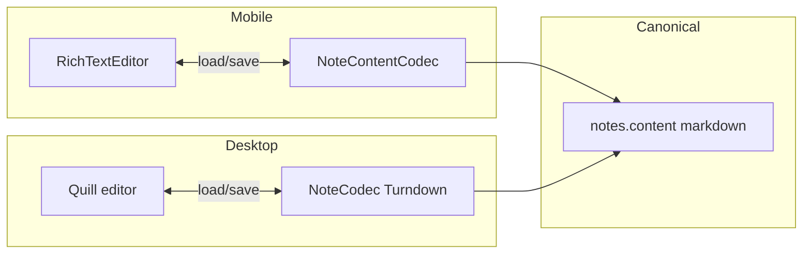
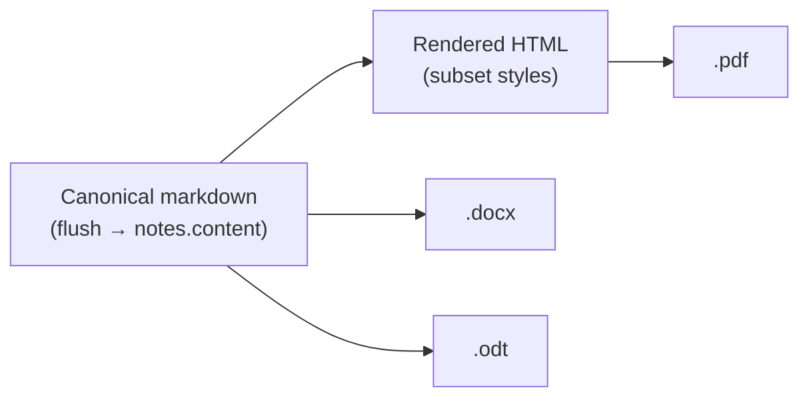

# Note Editor Hardening — Implementation Plan

**Status:** Active — 2026-07-13  
**Audience:** Mobile + desktop implementers, Eidos prompt authors  
**Related:** [NOTE_PERSISTENCE_MODEL.md](../architecture/NOTE_PERSISTENCE_MODEL.md) (**canonical persistence/versioning model — working copy vs history**), [EDITOR_AND_PANELS.md](../architecture/EDITOR_AND_PANELS.md), [DIFF_REVIEW.md](../architecture/DIFF_REVIEW.md), [DUMPEDIT.md](../architecture/DUMPEDIT.md), [DESKTOP_SYNC_MOBILE_PHASE2.md](./DESKTOP_SYNC_MOBILE_PHASE2.md) (markdown canonical storage), [cross-repo/README.md](../cross-repo/README.md)

> **Persistence model moved:** the git-like working-copy vs version-history design (Phase 1b, revised Phase 3, anti-patterns) now lives in [NOTE_PERSISTENCE_MODEL.md](../architecture/NOTE_PERSISTENCE_MODEL.md). This plan tracks task execution; that doc is the source of truth for the model.

Tracks work to make the **note + DumpEdit** editor trustworthy for human writing and LLM co-op: one supported markdown subset, reliable saves, honest toolbars on mobile and desktop, clear version history, and formatting-preserving export/share.

**Desktop coordinator copy:** add `note-editor-plan.md` in [OptimalXDesktop1.0](https://github.com/Tuf12/OptimalXDesktop1.0) when Phase 5 starts (same phase table + desktop file paths).

---

## Problem

| Issue | Impact |
|-------|--------|
| Mobile saves only on dispose / `ON_STOP` (no debounced DB write) | Bullets, headings, and other formatting lost when leaving the note |
| **WYSIWYG re-encodes markdown on open/leave** even without user edits | Formatting drifts for user and Eidos writes; run-on sentences |
| **Edit mode default on open** loads richeditor immediately | View-only reads still spin up lossy buffer + dirty tracking |
| Mobile toolbar exposes S/M/L/XL font size and underline | Visual-only; does not persist in markdown (underline becomes raw `<u>` HTML) |
| Toolbar **Undo / Redo** calls `EditorViewModel.undo/redo` | Misleading — not keystroke undo; only walks a save-time content deque, separate from **History** (checkpoints) |
| Export / Share uses `richTextState.toText()` | Strips all markdown formatting |
| Desktop note editor | Quill + toolbar wired in code (`wysiwyg-editor.js`) but **not usable in practice** — users see no working formatting tools; must be fixed and aligned with mobile subset |

Canonical storage remains **markdown** in `notes.content` / DumpEdit buffer via [`NoteContentCodec.kt`](../../src/main/java/com/example/optimalx/ui/components/NoteContentCodec.kt) (mobile) and [`note-content-codec.js`](https://github.com/Tuf12/OptimalXDesktop1.0/blob/main/renderer/js/note-content-codec.js) (desktop).

---

## Supported markdown subset (contract)

Both platforms implement **only** this set in WYSIWYG toolbars. Eidos and sync must not rely on anything outside it.

| Feature | Markdown | UI |
|---------|----------|-----|
| Title | `# line` | Heading → Title |
| Section | `## line` | Heading → Section |
| Subsection | `### line` | Heading → Subsection |
| Body | plain paragraph | Heading → Normal |
| Bold | `**text**` | Toolbar |
| Italic | `*text*` | Toolbar |
| Strikethrough | `~~text~~` | Toolbar |
| Bullet list | `- item` | Toolbar |
| Numbered list | `1. item` | Toolbar |
| Link | `[text](url)` | Toolbar + URL prompt |
| Inline code | `` `code` `` | Toolbar |

**Not supported (remove / do not add):**

| Feature | Why |
|---------|-----|
| Underline | Encodes as `<u>` HTML inside markdown — weak for sync and Eidos |
| Arbitrary font size (S/M/L/XL) | No standard markdown representation |
| Raw HTML in body | Legacy rows migrate on load; new writes avoid HTML |
| Fenced code blocks | Richeditor round-trip drops them (document as known limitation) |

---

## Phase 0 — Canonical stability (P0)

**Goal:** Opening/viewing a note never mutates stored markdown. WYSIWYG loads only in Edit mode.

| Task | File(s) | Done |
|------|---------|------|
| Default **View mode** on open (Note + DumpEdit) | `EditorViewModel.kt`, `DumpEditViewModel.kt` | [x] |
| Lazy WYSIWYG: defer `loadIntoRichText` until Edit; View reads canonical markdown only | `NotePanel.kt`, `DumpEditPanel.kt` | [x] |
| `userHasEdited` + gated `shouldPersistOnLifecycle` | `EditorViewModel.kt`, `NoteEditorSyncPolicy.kt`, DumpEdit VM | [x] |
| Gate `snapshotFlow` + lifecycle save on Edit mode only | `NotePanel.kt`, `DumpEditPanel.kt` | [x] |
| Eidos reload skips when `userHasEdited`; View refreshes display from DB | `EditorViewModel.kt`, `NotePanel.kt` | [x] |
| Desktop default View on open + flush auto-save before leave confirm | `editor.js`, `dumpedit.js`, `core.js` | [x] |
| Unit tests: sync policy guards | `NoteEditorSyncPolicyTest.kt` | [x] |

**Done when:** Open note in View → leave → `notes.content` byte-identical.

---

## Phase 1 — Mobile save reliability (P0)

**Goal:** Lists, headings, and all edits persist when leaving the note or DumpEdit.

| Task | File(s) | Done |
|------|---------|------|
| 500ms debounced save to Room from `onNoteEditorSnapshot` | [`EditorViewModel.kt`](../../src/main/java/com/example/optimalx/ui/editor/EditorViewModel.kt) | [x] |
| `suspend fun flushNoteBeforeExit()` — cancel debounce, `NonCancellable` persist if dirty | `EditorViewModel.kt` | [x] |
| `noteSaveStatus` (`Unsaved` / `Saving` / `Saved`) for inline feedback | `EditorViewModel.kt`, [`EditorScreen.kt`](../../src/main/java/com/example/optimalx/ui/editor/EditorScreen.kt) | [x] |
| Call `flushNoteBeforeExit()` on back from Note (BackHandler + title tap) | `EditorScreen.kt` | [x] |
| After toolbar format actions, explicit `onEditorSnapshot(persistContent(...))` | [`NotePanel.kt`](../../src/main/java/com/example/optimalx/ui/editor/panels/NotePanel.kt) | [x] |
| Mirror debounced save + flush for DumpEdit | [`DumpEditViewModel.kt`](../../src/main/java/com/example/optimalx/ui/dumpedit/DumpEditViewModel.kt), [`DumpEditScreen.kt`](../../src/main/java/com/example/optimalx/ui/dumpedit/DumpEditScreen.kt), [`DumpEditPanel.kt`](../../src/main/java/com/example/optimalx/ui/dumpedit/DumpEditPanel.kt) | [x] |
| Unit tests: debounce fires; flush persists pending content | `NoteEditorDebouncedSaverTest.kt` | [x] |
| Optional androidTest: bullet list → exit → reopen → DB has `- ` | `androidTest/...` | [ ] |

**Done when:** User applies bullet list or heading, navigates away immediately, reopens note — formatting is still present.

---

## Phase 2 — Mobile toolbar (subset-aligned)

**Goal:** Toolbar only offers tools that persist; mirror desktop Quill **headers** as Title / Section / Subsection / Normal.

| Task | File(s) | Done |
|------|---------|------|
| New `NoteRichTextActions.kt` — `NoteHeadingLevel`, `applyHeading`, `toggleInlineCode`, `applyLink`, `detectHeadingLevel` | `ui/editor/components/NoteRichTextActions.kt` | [x] |
| Remove `NoteFontSize`, underline button | [`FormattingToolbar.kt`](../../src/main/java/com/example/optimalx/ui/editor/components/FormattingToolbar.kt) | [x] |
| Add heading cycle, strike on bar, link + code buttons | `FormattingToolbar.kt` | [x] |
| Link URL `AlertDialog` | `FormattingToolbar.kt` or `NotePanel.kt` | [x] |
| Remove strikethrough from dropdown | [`EditorDropdownMenu.kt`](../../src/main/java/com/example/optimalx/ui/editor/components/EditorDropdownMenu.kt) | [x] |
| Wire Note + DumpEdit panels | `NotePanel.kt`, `DumpEditPanel.kt` | [x] |
| Round-trip tests: headings, link, code, lists; remove font-size test | [`NoteContentCodecRoundTripTest.kt`](../../src/test/java/com/example/optimalx/ui/components/NoteContentCodecRoundTripTest.kt) | [x] |

**Heading implementation note:** Richeditor maps `#` / `##` / `###` via span styles (`2.em` / `1.5.em` / `1.17.em` + bold). `NoteRichTextActions` must use matching `SpanStyle` values so `toMarkdown()` emits ATX headings.

---

## Phase 3 — Version history vs toolbar undo (P1)

**Goal:** One clear model for “go back in time” — **checkpoints (HEAD)**, not fake undo icons. User **Commit** for human edits; Diff Review for Eidos only. Canonical model: [NOTE_PERSISTENCE_MODEL.md](../architecture/NOTE_PERSISTENCE_MODEL.md).

### Shipped (toolbar cleanup)

| Control | Actual behavior |
|---------|-----------------|
| Toolbar Undo / Redo | Removed — was walking `contentHistory` deque on save, not per keystroke |
| Top bar History | [`ContentHistorySheet`](../../src/main/java/com/example/optimalx/ui/workshop/components/ContentHistorySheet.kt) — checkpoint timeline + restore |

| Task | File(s) | Done |
|------|---------|------|
| Remove undo/redo from formatting toolbar + ViewModel wiring from panels | `FormattingToolbar.kt`, `NotePanel.kt`, `DumpEditPanel.kt` | [x] |
| Remove `contentHistory` deque + `undo`/`redo` from ViewModels | `EditorViewModel.kt`, `DumpEditViewModel.kt` | [x] |
| Document: History = checkpoints; no multi-step document undo in toolbar | `EDITOR_AND_PANELS.md` | [x] |

### Target (Phase 3 revision — Commit model)

| Control | Behavior |
|---------|----------|
| Toolbar | No undo/redo |
| Top bar **Commit** | When working copy ≠ HEAD → `commitWorkingCopy(author=user)` |
| Top bar **Review N** | Eidos Diff Review only |
| Top bar **History** | User commits, auto-commits, Eidos accepts, restores |
| Leave / flush | `persistWorkingCopy` only — not HEAD |
| Auto-commit | Before Eidos `write_note` / `note_replace_string` when dirty vs HEAD |

| Task | File(s) | Done |
|------|---------|------|
| Split `persistWorkingCopy` vs `commitWorkingCopy`; remove checkpoint from flush paths | `EditorViewModel.kt` | [x] |
| `isDirtyVsHead()` + Commit button in `EditorTopBar` | `EditorViewModel.kt`, `EditorTopBar.kt`, `EditorScreen.kt` | [x] |
| Auto-commit in Eidos pre-tool path when dirty | `NoteWriteRouter.kt`, `CheckpointRepository.kt`, `RoomToolExecutor.kt` | [x] |
| Remove debounced save / `snapshotNoteCheckpoint` on lifecycle flush | `EditorViewModel.kt`, `NoteEditorWorkingCopyFlusher.kt` | [x] |
| Tests: leave no seq; Commit creates seq; auto-commit before Eidos queue | `NoteHeadDirtyTest.kt`, `CheckpointRepositoryTest.kt` | [x] |
| Desktop Commit + auto-commit parity | `note-editor-plan.md`, `editor.js` | [ ] |

**Done when:** No undo/redo on formatting bar; Commit advances HEAD; leave-flush does not; paste + Eidos send auto-commits before Diff Review; History restore works.

---

## Phase 4 — Export & Share (markdown) (P1)

**Goal:** Export and share emit **rendered HTML** for external apps (Drive, browsers, readers). Canonical markdown is still flushed to `notes.content` first; export/share converts markdown → HTML. Raw `.md` remains available on desktop. Document formats (PDF, DOCX, ODT) are **Phase 4b**.

### Mobile

| Task | File(s) | Done |
|------|---------|------|
| Share: rendered HTML via `Intent.ACTION_SEND` (`text/html` + plain fallback) | `NotePanel.kt`, `DumpEditPanel.kt`, `NoteExport.kt` | [x] |
| Export: write rendered `.html` via `CREATE_DOCUMENT` | `NoteExport.kt` | [x] |
| Flush editor before export/share so latest WYSIWYG is in markdown | call `persistContent` / pending snapshot | [x] |
| DumpEdit parity | `DumpEditPanel.kt` | [x] |

### Desktop

| Task | File(s) | Done |
|------|---------|------|
| Add Export / Share actions if missing | `renderer/js/editor.js`, editor menu | [x] |
| Export `.md` file via Electron dialog (`showSaveDialog`) | `electron/ipc/handlers.js` or renderer | [x] |
| Share: system share or copy markdown to clipboard | renderer | [x] |
| Source: `App.Wysiwyg.getMarkdown('note')` after sync | `markdown-view.js` | [x] |

### Documentation

| Task | Done |
|------|------|
| `EDITOR_AND_PANELS.md` — Export / Share section: default format `.md`, markdown bytes match DB | [x] |
| Cross-repo: note in desktop `features.md` parity row | [x] |

**Done when:** Shared/exported files show rendered headings, bold, and lists in Drive, browsers, and readers — not raw `**` / `#` symbols. DB `notes.content` stays canonical markdown after flush.

---

## Phase 4b — Document export (PDF, DOCX, ODT) (P2)

**Goal:** Let users **export** (not share-as-chat) a note as common office/PDF formats for printing, email attachments, and handoff to Word/LibreOffice — without making those formats canonical storage.

**Prerequisite:** **Phase 4 shipped** — every export path reads flushed canonical markdown (or `notes.content`), via a single `NoteExport` / desktop export helper. Phase 4b adds **format converters** on top; it does not change Room storage or sync.

### Pipeline (both platforms)

| Step | Rule |
|------|------|
| Source | Always Phase 4 markdown bytes — same subset as [Supported markdown subset](#supported-markdown-subset-contract) |
| HTML | Intermediate for PDF (and optional print preview); use existing `MarkdownNoteView` / `marked` styling where possible |
| Round-trip | **Out of scope** — document export is write-only; re-import is not supported |
| Fidelity | Headings, bold/italic/strike, lists, links, inline code only; no guarantee for unsupported constructs |

### Format priority

| Format | Priority | Rationale |
|--------|----------|-----------|
| **PDF** | **4b.1** (ship first) | Fixed layout, universal share/print; desktop has `printToPDF`; Android has Print / `PdfDocument` / WebView print |
| **DOCX** | **4b.2** | Word handoff; desktop can shell **Pandoc** or a Node `docx` builder; mobile likely “export + open in Word” or minimal embedded converter |
| **ODT** | **4b.2** | LibreOffice parity; same converter stack as DOCX (Pandoc on desktop) |

### Mobile (4b)

| Task | File(s) | Done |
|------|---------|------|
| **4b.1 PDF** — export menu: markdown → HTML → PDF (`PrintManager` + adapter, or `PdfDocument` / WebView print pipeline) | `NoteExport.kt`, `NotePanel.kt`, optional `NotePdfExport.kt` | [x] |
| **4b.2 DOCX** — evaluate: (A) Pandoc not on device → defer to “share .md” + document provider, (B) lightweight on-device lib, or (C) server-side out of scope | `NoteExport.kt` | [x] desktop Pandoc; mobile deferred |
| **4b.2 ODT** — same decision as DOCX; ship only if converter path is acceptable on APK size | `NoteExport.kt` | [x] desktop Pandoc; mobile deferred |
| Export format picker in dropdown (`.md` from Phase 4 + PDF + office formats when available) | `EditorDropdownMenu.kt`, `NotePanel.kt` | [x] |
| Flush before any document export (reuse Phase 4) | `NotePanel.kt`, `EditorViewModel.kt` | [x] |
| DumpEdit parity for PDF (office formats if mobile path exists) | `DumpEditPanel.kt` | [x] |

**Mobile done when (minimum):** User exports note as **PDF** with headings/lists/bold visible; file opens in a PDF viewer. DOCX/ODT ship when a chosen converter path is documented in this table.

### Desktop (4b)

| Task | File(s) | Done |
|------|---------|------|
| **4b.1 PDF** — `webContents.printToPDF` or print dialog on rendered note HTML | `electron/ipc/handlers.js`, `renderer/js/note-export.js` (new) | [x] |
| **4b.2 DOCX** — Pandoc (`pandoc -f markdown -t docx`) or Node `docx` package from canonical markdown | `electron/files/` or `renderer/js/note-export.js`, IPC | [x] |
| **4b.2 ODT** — Pandoc (`-t odt`) same entry point as DOCX | same | [x] |
| Save dialog filter: Markdown, PDF, Word, ODF | `electron/ipc/handlers.js` | [x] |
| Bundle / document Pandoc dependency in desktop README or installer notes | `README.md`, `note-editor-plan.md` | [x] |

**Desktop done when:** User saves same note as `.md`, `.pdf`, and at least one of `.docx` / `.odt` with subset formatting preserved.

### Documentation (4b)

| Task | Done |
|------|------|
| `EDITOR_AND_PANELS.md` — Export formats table (md = canonical; pdf/docx/odt = export-only) | [x] |
| `note-editor-plan.md` — Phase 4b desktop tasks + Pandoc note | [x] |
| `features.md` (desktop) — parity row for document export | [x] |

### Explicitly out of scope for 4b

- EPUB, LaTeX, RTF, HTML file export as a primary deliverable (HTML remains an internal PDF step only unless promoted later)
- Importing PDF/DOCX/ODT back into OptimalX notes
- Perfect WYSIWYG match to Quill/richeditor pixel layout in office formats
- Cloud conversion APIs (privacy / offline-first)

---

## Phase 5 — Desktop formatting toolbar (P1)

**Goal:** Ship a **working** WYSIWYG toolbar on desktop note + DumpEdit, aligned with the subset above.

**Current state:** HTML has `#note-toolbar` + Quill init in [`wysiwyg-editor.js`](https://github.com/Tuf12/OptimalXDesktop1.0/blob/main/renderer/js/wysiwyg-editor.js) (`App.Wysiwyg.initAll()` in `app.js`), but formatting is **not available to users** in practice (broken init, CSS, or toolbar config — fix during implementation).

| Task | File(s) | Done |
|------|---------|------|
| Diagnose why Quill toolbar does not appear / function | `wysiwyg-editor.js`, `index.html`, `app.css` | [ ] |
| Trim Quill `TOOLBAR` to subset: `header [1,2,3,false]`, bold, italic, strike, lists, link, code-inline | `wysiwyg-editor.js` | [ ] |
| **Remove** underline, blockquote, code-block, clean (or keep code-block only if round-trip tested) | `wysiwyg-editor.js` | [ ] |
| Verify Turndown round-trip for each tool | `note-content-codec.js`, manual + optional `tests/` | [ ] |
| Flush markdown on leave (`confirmLeaveUnsaved` path) | `core.js`, `editor.js` | [ ] |
| DumpEdit same toolbar config | `wysiwyg-editor.js` | [ ] |

**Parity matrix (gate before closing phase):**

| Tool | Mobile | Desktop |
|------|--------|---------|
| Title / Section / Subsection / Normal | Phase 2 | Quill header |
| Bold / italic / strike | Phase 2 | Quill |
| Bullet / numbered | Phase 2 | Quill |
| Link / inline code | Phase 2 | Quill |
| Underline / font size | Removed | Removed |

---

## Phase 6 — Docs & Eidos (ongoing)

| Task | File(s) | Done |
|------|---------|------|
| Replace toolbar table in `EDITOR_AND_PANELS.md` with subset + save/history/export sections | `EDITOR_AND_PANELS.md` | [ ] |
| One line in Eidos note rules for supported markdown | [`EidosSystemPromptLayers.kt`](../../src/main/java/com/example/optimalx/data/eidos/prompt/EidosSystemPromptLayers.kt) `NOTE_WRITE_RULES` | [ ] |
| Link this plan from `app/docs/README.md` | `README.md` | [ ] |
| Link from `cross-repo/README.md` | `cross-repo/README.md` | [ ] |

**Eidos line (target copy):**

> Use only supported note markdown: headings (`#`–`###`), bold, italic, strike, bullet/numbered lists, links, and inline code — not HTML tags, underline, or font sizes.

---

## Phase summary

| Phase | Focus | Platform | Priority |
|-------|--------|----------|----------|
| 0 | Canonical stability (View default, lazy WYSIWYG) | Mobile + Desktop | P0 |
| 1b | Working copy flush (remove debounce checkpoints) | Mobile | P0 |
| 2 | Toolbar subset | Mobile | P0 |
| 3 | Commit model + History; toolbar undo removed | Mobile + Desktop | P1 |
| 4 | Export / Share **markdown** (`.md`) | Mobile + Desktop | P1 |
| 4b | Document export **PDF → DOCX/ODT** | Mobile + Desktop | P2 |
| 5 | Working Quill toolbar | Desktop | P1 |
| 6 | Docs & Eidos | Both | P1 |

Recommended order: **0 → 1b → 2 → 6 (minimal)** → **3 → 4 → 4b.1 (PDF)** → **5** (4 and 5 can parallelize across repos). **4b.2** (DOCX/ODT) after 4b.1 or in parallel on desktop where Pandoc is available.

> Phase 1 (500ms debounced save) shipped 2026-07-16 but is **superseded** by Phase 1b per [NOTE_PERSISTENCE_MODEL.md](../architecture/NOTE_PERSISTENCE_MODEL.md).

---

## File touch list (all phases)

| File | Phases |
|------|--------|
| `EditorViewModel.kt` | 1, 3 |
| `EditorScreen.kt` | 1 |
| `NotePanel.kt` | 1, 2, 4 |
| `DumpEditViewModel.kt`, `DumpEditScreen.kt`, `DumpEditPanel.kt` | 1, 2, 4 |
| `NoteRichTextActions.kt` | 2 (new) |
| `FormattingToolbar.kt` | 2, 3 |
| `EditorDropdownMenu.kt` | 2 |
| `NoteExport.kt` | 4, 4b (new) |
| `NotePdfExport.kt` | 4b (new, optional) |
| `NoteContentCodecRoundTripTest.kt`, `EditorViewModelSaveTest.kt` | 1, 2 |
| `EDITOR_AND_PANELS.md`, `EidosSystemPromptLayers.kt` | 6 |
| Desktop: `wysiwyg-editor.js`, `note-content-codec.js`, `editor.js`, `core.js` | 4, 5 |
| Desktop: `renderer/js/note-export.js`, `electron/ipc/handlers.js` | 4, 4b |

---

## Out of scope (explicit deferrals)

- Fenced code block support in mobile richeditor
- Markdown source tab on mobile (WYSIWYG-only for v1)
- Desktop blockquote / tables in notes
- Real-time collaborative cursors
- Document **import** (PDF/DOCX/ODT → note) — export-only in Phase 4b
- EPUB / LaTeX / RTF export (see Phase 4b; add only if requested after 4b.2)

---

## Changelog

| Date | Change |
|------|--------|
| 2026-07-17 | **Phase 4b planned** — PDF (4b.1), DOCX/ODT (4b.2) document export on top of Phase 4 markdown; Pandoc/desktop-first for office formats. |
| 2026-07-17 | **Phase 3 revision shipped** — Commit button, `isDirtyVsHead`, auto-commit before Eidos |
| 2026-07-17 | **Commit model** documented — user Commit + auto-commit before Eidos; Phase 3 revision tasks; supersedes debounced checkpoints |
| 2026-07-17 | Phase 3 shipped — removed toolbar undo/redo and `contentHistory` deque; History sheet is canonical restore path |
| 2026-07-17 | Hotfix — stop debounced save from clearing `userHasEdited` (WYSIWYG reload loop); heading applies to selection; editor `imePadding` + scroll |
| 2026-07-17 | Phase 2 shipped — `NoteRichTextActions`, toolbar subset (H1/H2/H3/P cycle, strike, link, code); removed underline + font size |
| 2026-07-16 | Phase 1 shipped — debounced save (500ms), flush on exit, save status UI, format-action snapshots |
| 2026-07-16 | Phase 0 shipped — View default on open, lazy WYSIWYG, `userHasEdited` save gating, desktop View default + flush on leave |
| 2026-07-13 | Initial plan — mobile save + toolbar, desktop toolbar fix, history/undo, export/share |
