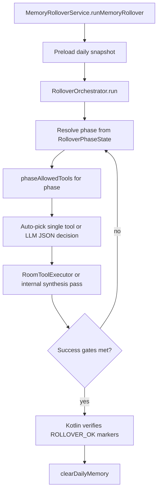

# ROLLOVER.md

## Purpose

Nightly **memory rollover** converts today's **Daily Memory** into durable **Journal** and **Long-Term Memory** entries, then clears Daily Memory only after Kotlin verifies success.

**Entry point:** [`MemoryRolloverService.runMemoryRollover`](../../src/main/java/com/example/optimalx/data/eidos/MemoryRolloverService.kt)  
**Loop:** [`RolloverOrchestrator`](../../src/main/java/com/example/optimalx/data/eidos/RolloverOrchestrator.kt)  
**Audit log:** [`RolloverAuditLogger`](../../src/main/java/com/example/optimalx/data/eidos/RolloverAuditLogger.kt) → daily note under **Eidos Reasoning**

Related: [MEMORY_SYSTEM.md](../memory/MEMORY_SYSTEM.md), [JOURNAL_SYSTEM.md](JOURNAL_SYSTEM.md).

---

## Flow



Rollover does **not** use the normal chat system prompt. `MemoryRolloverService` builds phase-specific decision prompts; the orchestrator enforces allowlists and milestone booleans in code.

---

## Phases and allowlists

Phase names are legacy labels; there is **no** AgentByte loop or chess-piece policy layer.

| Phase | Allowed tools / actions |
|-------|-------------------------|
| `KING_INIT` | `read_daily_memory` |
| `ROOK_READ_DAILY` | `read_journal` |
| `ROOK_KNIGHT_SEARCH` | `read_long_term_memory`, `search_semantic`, `search_chat_history` |
| `ROOK_LOGICAL_PASS` | `ROOK_LOGICAL_PASS` (internal), `read_journal`, `read_long_term_memory`, `search_semantic`, `search_chat_history` |
| `BISHOP_REFLECTIVE_PASS` | `BISHOP_REFLECTIVE_PASS` (internal) |
| `ROOK_PAWN_JOURNAL_WRITE` | `ROOK_PAWN_JOURNAL_WRITE` (internal) |
| `ROOK_PAWN_LTM_PROMOTION` | `ROOK_PAWN_LTM_PROMOTION` (internal) |
| `KING_VERIFY_CLOSE` | *(none — verification only)* |

Source of truth: `RolloverOrchestrator.phaseAllowedTools` and `RolloverPhaseState.currentPhase()`.

**Retrieval during rollover:** `search_semantic` and targeted reads — not Tag & Hint / Eidos Index (removed).

---

## Success gates

The loop rejects early `complete` until:

- `ltmPromotionComplete`
- `successGatesVerified`

`MemoryRolloverService` parses synthesis output for `ROLLOVER_OK` / `ROLLOVER_EMPTY` markers before clearing Daily Memory.

---

## Audit logging (markdown)

Each run appends human-readable blocks to the **Eidos Reasoning** daily subfolder (`yyyy-MM-dd`):

```text
[2026-06-21T12:00:00] rollover|run_id=rr_20260621_120000|event=run_start|prompt_label=Nightly memory rollover orchestration

Rollover run started.

[2026-06-21T12:00:05] rollover|run_id=rr_20260621_120000|phase=ROOK_LOGICAL_PASS|step=search_semantic|iteration=3

Semantic search returned 4 hits for daily themes.
```

Events: `run_start`, per-step (`appendStep`), `run_end` (exit reason + iteration count).

**UI:** [ReasoningInboxViewModel](../../src/main/java/com/example/optimalx/ui/reasoning/ReasoningInboxViewModel.kt) parses these via `RolloverAuditLogger.parseMarkdownChunk`. Legacy `ABR1|` JSON lines in older notes remain as raw text.

---

## Scheduling

[`MemoryRolloverScheduler`](../../src/main/java/com/example/optimalx/data/eidos/MemoryRolloverScheduler.kt) ensures a nightly WorkManager job. **Settings → Force memory rollover** calls the same `runMemoryRollover()` path.

---

## What is not in EidosToolCatalog

Internal synthesis actions (`ROOK_LOGICAL_PASS`, `BISHOP_REFLECTIVE_PASS`, `ROOK_PAWN_JOURNAL_WRITE`, `ROOK_PAWN_LTM_PROMOTION`) and orchestration-only helpers are handled inside `RolloverOrchestrator` / `RoomToolExecutor` — not exposed to normal chat.
